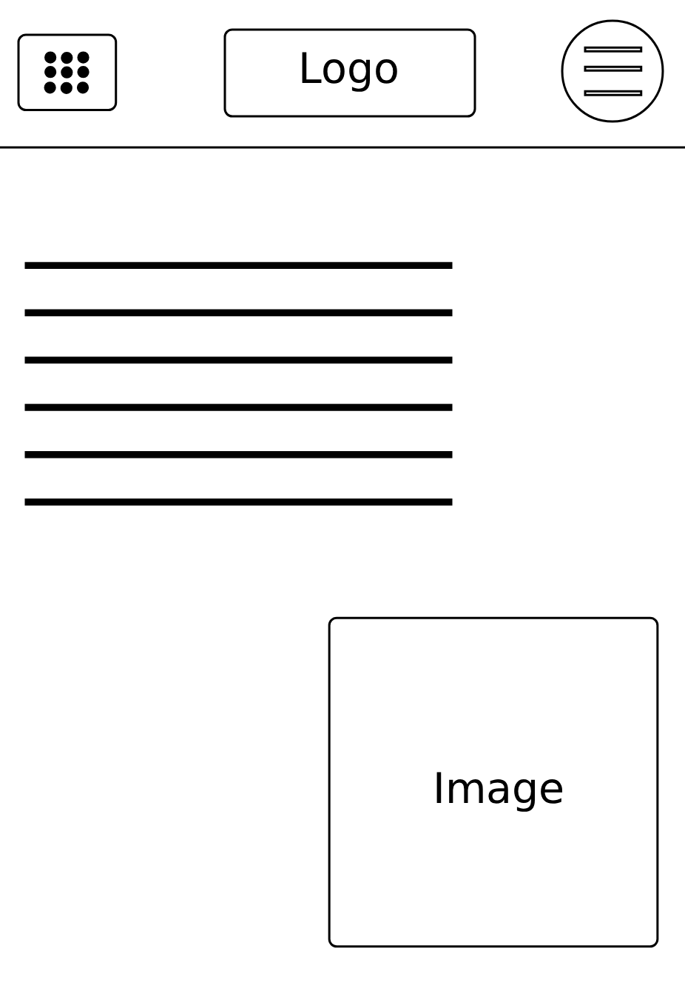

# EduTechSmart - landingpage

## Project Overview

Lorem

## Pitch

Your landing page is often the initial point of contact - and for most of your customers, it's their very first impression.
Today, more than 70% of web traffic comes from mobile devices, which means a mobile-first, fast-loading landing page is essential for a great user experience.

By modernizing the layout, focusing on the mobile first approach, and using the latest technologies we can improve the user experience and make the site more engaging and trustworthy.

## Backlog and planned features

Modern and trustworthy design.
Responsiveness (Mobile-first).
Accessibility .
Dark Mode for visual enhancement.
%% Color Blind - Mode %%
Balance of visuals and text.
Easily accessible information.
Rounder and more welcoming shapes.
Glass effects components for visual appeal.

## Milestones

MVP - 
QA/Testing - 
UI/UX Improvements - 
Features Completed - 

## Status

Planning stages

## Design Ideas

Wireframe for the Hero Page.

### Color Palett

README – ska minst innehålla:
• Kort sammanfattning av projektet och vad ni vill uppnå.
• Backlog och planerade features (lista med issues/milestones kopplade).
• Färgschema och designidéer (t.ex. screenshots, färgpalett, skisser).
• Status (vad som är klart, vad som pågår, vad som kommer sen).
• Pitch – varför ert upplägg är rätt för Edutechsmart.
Tänk hela tiden att README är det första Matti ser – den ska vara tydlig, snygg och lockande.
